# Introduction, History, and Internet Architecture

## A Brief History of the Internet

### J.C.R. Licklider proposed the "Galactic Network" (1962)
The first vision of a Network - proposed as “Galactic Network” - by J.C.R. Licklider was at MIT back in 1962. He envisioned that everyone could quickly access data through a set of interconnected computers. Licklider - as the head of the research program at Defense Advanced Research Projects Agency (DARPA) - led a group of researchers to experiment connecting two computers. An MIT researcher, Lawrence G. Roberts connected one computer in MA to another computer located in CA with a low-speed dial-up telephone line. 

### The ARPANET (1969)
The results of the first experiments showed that time-shared infrastructure was working sufficiently well at that moment. But also at the same time researchers indicated the need for packet switching technology. Roberts continued developing the computer network concept, which resulted in the first network which was connecting four nodes (from UCLA, Stanford Research Institute, UCSB and Univ. of Utah, respectively) into the initial ARPANET by the end of 1969.

### Network Control Protocol (NCP), an initial ARPANET host-to-host protocol (1970)
As the number of computers that were added to the ARPANET increased quickly, research work proceeded to designing protocols. The initial ARPANET Host-to-Host protocol called Network Control Protocol (NCP) was introduced in 1970, and it allowed the network users to begin developing applications. One of the first applications that launched was email in 1972.

### Internetworking and TCP/IP (1973)
At the same time, a DARPA team of researchers led by Bob Kahn, introduced the idea of open-architecture networking so that the individual networks may be independently designed and developed, in accordance with the specific environment and user requirements of that network. This led researchers to develop a new version of the NCP protocol which would eventually be called the Transmission Control Protocol / Internet Protocol (TCP/IP). Khan collaborated with Vint Cerf in Stanford and presented the original TCP paper in 1973. The first version of TCP later split its functionalities into two protocols, the simple IP which provided only for addressing and forwarding of individual packets, and the separate TCP which focused on service features such as flow control and recovery from lost packets. 

### The Domain Name System (DNS) (1983) and the World Wide Web (WWW) (1990)
The scale of the Internet was increasing rapidly, and as a result it was no longer feasible to have a single table of hosts to store names and addresses. The Domain Name System (DNS) - which was designed to translate domain names to IP addresses by a scalable distributed mechanism - was introduced by Paul Mockapetris at USC in 1983. More applications sprung up quickly. One of the first and most popular applications was the World Wide Web (WWW), which was introduced by a team of researchers led by Tim Berners-Lee.

## Internet Architecture Introduction

After looking at the major milestones in the history of the Internet, let’s take a closer look into the current architectural design of the Internet. 

**Connecting hosts running the same applications but located in different types of networks.** A computer network is a complex system that is built on top of multiple components. These components can vary in technologies making up different types of networks that offer different types of applications. For example in the figure below, we have two BitTorrent clients that communicate even though they are using very different networks/technologies (Wifi vs Ethernet). So, how do these technologies and components interconnect and come together to meet the needs of each application? The designers of the network protocols provide structure to the network architecture by organizing the protocols into layers.

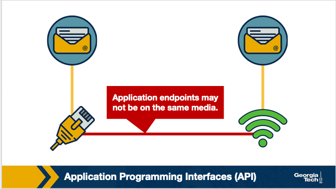

**Architecture, layers and functionalities.** So, the functionalities in the network architecture are implemented by dividing the architectural model into layers. Each layer offers different services. 

**An analogy.** An analogy we can use to explain a layered architecture is the airline system. Let’s look first at the actions that a passenger needs to take to move from the origin to the destination place. The passenger purchases the ticket, checks the bags, goes through the gates and after the plane takes off, the passenger travels on the plane to their final destination. At the final destination, the passenger leaves the aircraft, goes through the gate and claims their baggage.

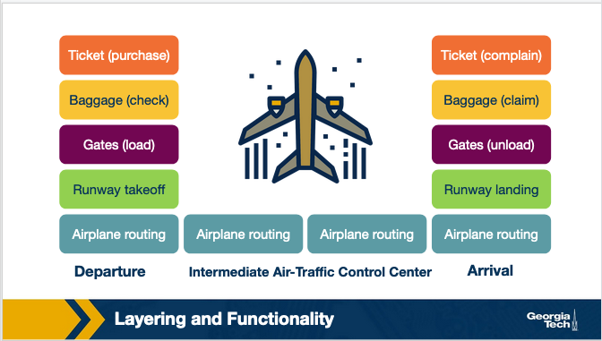

We can look at the above picture to identify a structure (or layers) and the services (or functionalities) that are offered at every component of the structure. Dividing the services into layers we get the framework below.  We notice that in this framework every layer implements some functionality. Every layer works based on the service provided by the layer below it, and also it provides some service to the layer that is above.  

The same principle of layers and functionalities is implemented with the model of the Internet architecture. 

**Layered architecture advantages: scalability, modularity, and flexibility.** Some of the advantages of having a layered network stack include scalability, modularity and the flexibility to add or delete components which makes it easier overall for cost-effective implementations.

## The OSI Model

The Internet architecture follows a layered model, where every layer provides some service to the layer above. 

The International Organization for Standardization (ISO) proposed the seven-layered OSI model shown below, which consists of the following layers: application layer, presentation layer, session layer, transport layer, network layer, data link layer, and physical layer.

We will see in later sections a possible explanation about why the Internet architecture came eventually to have this form. Separating the functionalities into layers offers multiple advantages. But, are there disadvantages of the layered protocol stack model? Some of the disadvantages include:

1. Some layers functionality depends on the information from other layers, which can violate the goal of layer separation.
2. One layer may duplicate lower layer functionalities. For example, the functionality of error recovery can occur in lower layers, but also on upper layers as well. 
3. Some additional overhead that is caused by the abstraction between layers.

In the following sections, we will go through a brief overview of the layers, and more specifically we will focus on what each layer does (service), how the layer is accessed (interface), how the layer is implemented (example protocols), and how we refer to the packet of information it handles.

**Note: The OSI reference model and the Internet architecture model**

The Internet architecture model though has five layers. The application, presentation, and session layers are combined into a single layer, and this combined layer is called the application layer. The interface between the application layer and the transport layer are the sockets. It is up to the application developer to design the functionality of the overall application.

## Application, Presentation, and Session Layers

### The Application Layer
The application layer includes multiple protocols, some of the most popular ones include: 1) The HTTP protocol (web), SMTP (e-mail), 2) The FTP protocol (transfers files between two end hosts), and 3) The DNS protocol (translates domain names to IP addresses). So the services that this layer offers are multiple depending on the application that is implemented. The same is true for the interface through which it is accessed, and the protocol that is implemented. At the application layer, we refer to the packet of information as a message.

### The Presentation Layer
The presentation layer plays the intermediate role of formatting the information that it receives from the layer below and delivering it to the application layer. For example, some functionalities of this layer are formatting a video stream or translating integers from big endian to little endian format.

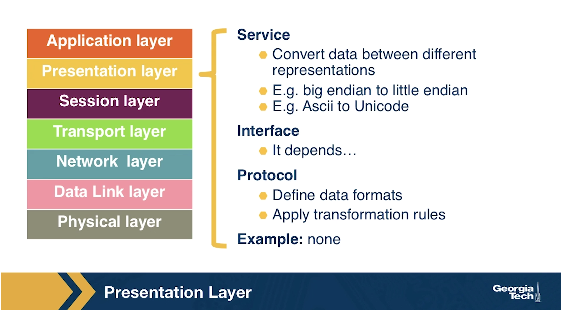

### The Session Layer
The session layer is responsible for the mechanism that manages the different transport streams that belong to the same session between end-user application processes. For example, in the case of teleconference application, it is responsible to tie together the audio stream and the video stream.

## Transport and Network Layer

### The Transport Layer
The transport layer is responsible for the end-to-end communication between end hosts. In this layer, there are two transport protocols, namely TCP and UDP. The services that TCP offers include: a connection-oriented service to the applications that are running on the layer above, guaranteed delivery of the application-layer messages, flow control which in a nutshell matches the sender’s and receiver’s speed, and a congestion-control mechanism, so that the sender slows its transmission rate when it perceives the network to be congested. On the other hand, the UDP protocol provides a connectionless best-effort service to the applications that are running in the layer above, without reliability, flow or congestion control. At the transport layer, we refer to the packet of information as a segment.

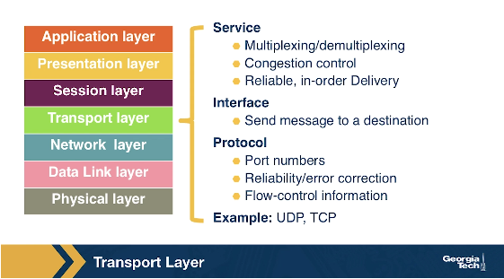

### The Network Layer
In this layer, we refer to the packet of information as a datagram. The network layer is responsible for moving datagrams from one Internet host to another. A source Internet host sends the segment along with the destination address, from the transport layer to the network layer. The network layer is responsible to deliver the datagram to the transport layer in the destination host. The protocols in the network layer are: 1) The IP Protocol, which we often refer to as “the glue” that binds the Internet together. All Internet hosts and devices that have a network layer must run the IP protocol. The IP protocol defines a) the fields in the datagram, and b) how the source/destination hosts and the intermediate routers use these fields, so the datagrams that a source Internet host sends reach their destination. 2) The routing protocols that determine the routes that the datagrams can take between sources and destinations.

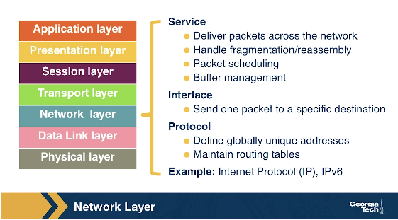

## Data Link Layer and Physical Layer

### The Data Link Layer
In this layer, we refer to the packets of information as frames. Some example protocols in this layer include Ethernet, PPP, WiFi. 

The data link layer is responsible to move the frames from one node (host or router) to the next node. More specifically, assuming we have a sender and receiver host, the network layer will route the datagram through multiple routers across the path between the sender and the receiver. At each node across this path, the network layer passes the datagram to the data link layer, which in turn delivers the datagram to the next node. Then, at that node, the link layer passes the datagram up to the network layer.

The data link layer offers services that depend on the data link layer protocol that is used over the link. Some example services include reliable delivery, that covers the transmission of the data from one transmitting node, across one link, and finally to the receiving node. We note that this specific type of reliable delivery service is different from the reliable delivery service that is offered by the TCP protocol which offers reliability from the source host to the destination end host.

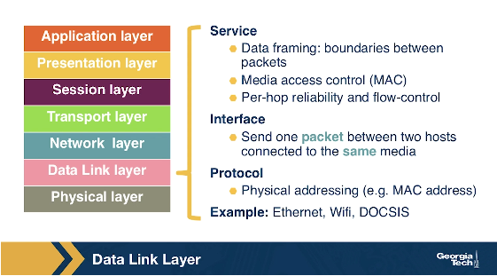

### The Physical Layer
The physical layer facilitates the interaction with the actual hardware and is responsible to transfer bits within a frame between two nodes that are connected through a physical link. The protocols in this layer again depend on the link and on the actual transmission medium of the link. One of the main protocols in the data link layer, Ethernet, has different physical layer protocols for twisted-pair copper wire, coaxial cable, and single-mode fiber optics. 

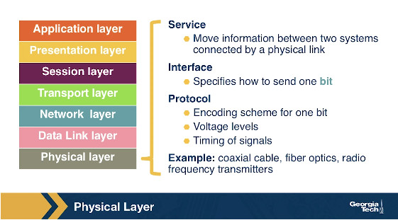

## Layers Encapsulation

**How do the layers and the protocols that run on each layer communicate with each other?** 
To understand the concepts of encapsulation and de-encapsulation, let’s take a look at the following diagram which shows the physical path that data take from the sending host to the receiving host.

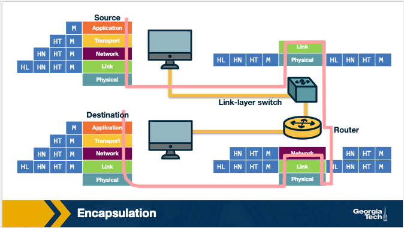

**Encapsulation and De-encapsulation.** The sending host sends an application layer message M to the transport layer. The transport layer receives the message, and it appends the transport layer header information (Ht). The application message along with the transport layer header is called segment (or transport-layer segment). The segment thus encapsulates the application layer message. This added information can help the receiving host to a) inform the receiver-side transport layer about which application to deliver the message up to, and b) perform error detection and determine whether bits in the message have been changed along the route. 

The segment is then forwarded to network layer which in turn, adds it’s own network header information (Hn). The entire combination of the segment and the network header is called datagram. We say that the datagram encapsulates the segment. The header information that the network layer appends includes the source and destination addresses of the end hosts. The same process continues for the link layer which in turn it appends its own header information(Hl). The message at the link layer is called frame, which is transmitted across the physical medium. At each layer the message is a combination of two parts: a) the payload which is the message from the layer above, and b) the new appended header information. At the receiving end, the process is reversed, with headers being stripped off at each layer. This reverse process is known as de-encapsulation.

Intermediate devices and encapsulation. The path that connects the sending and the receiving hosts may include intermediate layer-3 devices, such as routers, and layer-2 devices such as switches. We will see later how switches and routers work, but for now we note that both routers and layer-2 switches implement protocol stacks similarly to end-hosts. The difference is that routers and layer-2 switches do not implement all the layers in the protocol stack; routers implement layers 1 to 3, and layer-2 switches implement layers 1 to 2. So, going back to our diagram, when the data leave the sending host and they are received by the layer-2 switch, the switch implements the same process of de-encapsulation to process the data and encapsulation to send the data forward to the next device. 

A design choice. We note again that end-hosts implement all five layers while the intermediate devices don’t. This design choice ensures that the Internet architecture puts much of its complexity and intelligence at the edges of the network while keeping the core simple. Next, we will look deeper into the so-called end-to-end principle.

## The End to End Principle

The end-to-end (e2e) principle is a design choice that characterized and shaped significantly the current architecture of the Internet. The e2e principle suggests that specific application-level functions usually cannot, and preferably should not be built into the lower levels of the system at the core of the network.

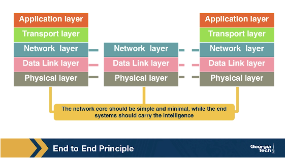

In simple terms, the e2e principle is summarized as: the network core should be simple and minimal, while the end systems should carry the intelligence. As mentioned in the seminal paper “End-to-End Arguments in System Design” by Saltzer, Reed, and Clark: 
> “The function in question can completely and correctly be implemented only with the knowledge and help of the application standing at the endpoints of the communications system. Therefore, providing that questioned function as a feature of the communications systems itself is not possible.”

The same paper reasoned that many functions can only be completely implemented at the endpoints of the network, so any attempt to build features in the network to support specific applications must be avoided,  or only viewed as a tradeoff. The reason was that not all applications need the same features and network functions to support them. Thus building such functions in the network core is rarely necessary. So, systems designers should avoid building any more than the essential and commonly shared functions into the network. 

Many people argue that the e2e principle allowed the internet to grow rapidly, because evolving innovation took place at the network edge, in the form of numerous applications and a plethora of services, rather than in the middle of the network, which could be hard to later modify.  

**What were the designers’ original goals that led to the e2e principle?** Moving functions and services closer to the applications that use them, increases the flexibility and the autonomy of the application designer to offer these services to the needs of the specific application. Thus, the higher-level protocol layers, are more specific to an application. Whereas the lower-level protocol layers are free to organize the lower-level network resources to achieve application design goals more efficiently and independently of the specific application.

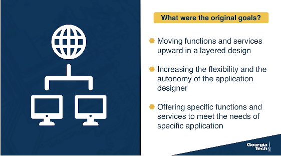

***Some data link layer protocols, such 802.11 (WiFi), implement some basic error correction as the physical medium used is easily prone to interference and noise (such as a nearby running microwave). Is this a violation of the end-to-end principle?***

No, because violations of the e2e principle typically refer to scenarios where it is not possible to implement a functionality entirely at the end hosts, such as NAT and firewalls.

In this question, we have a lower level protocol implementing error checking.

## Violations of the End-to-End Principle and NAT Boxes

Despite the fact that the e2e principle offers multiple advantages to the Internet and its evolution, there have still been cases where this principle needs to be violated. 

### Examples of the E2E violation

Examples include firewalls and traffic filters. The firewalls usually operated at the periphery of a network and they monitor the network traffic that is going through, to allow or drop traffic, if the traffic is flagged as malicious. Firewalls violate the e2e principle since they are intermediate devices that are operated between two end hosts and they can drop the end hosts communication.

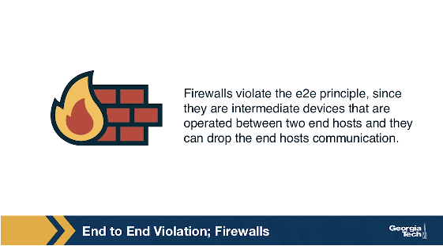

Another example of an e2e violation is the Network Address Translation (NAT) boxes. NAT boxes help us as a bandaid measure to deal with the shortage of Internet addresses. Let’s see in more detail how a NAT-enabled home router operates.  Let’s assume we have a home network, where we have multiple devices we want to connect to the Internet. An internet service provider typically assigns a single public IP address (120.70.39.4) to the home router and specifically to the interface that is facing the public global Internet, as shown in the figure below.

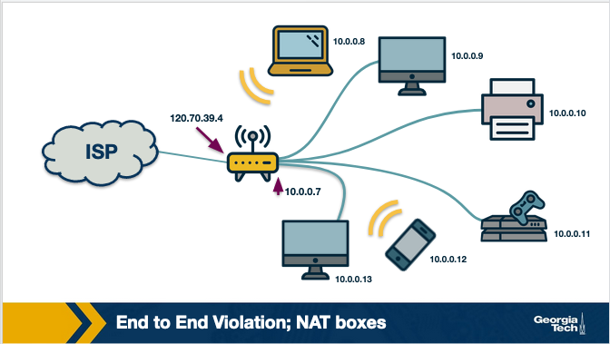

The other interface of the NAT-enabled router that is facing the home network (along with all other device-interfaces in the home network) gets an IP address that belongs to the same private subnet. This subnet must belong to the address spaces that are reserved as private, eg 10.0.0/24 or 192.168.0.0/24. This means that the IP addresses that belong to this private subnet only have meaning to devices within that subnet. So we can have hundreds of thousands of private networks with the same address range (eg 10.0.0.0/24). But, these private networks are always behind a NAT, which takes care of the communication between the hosts on the private network and the hosts on the public Internet.

All traffic that leaves the home router and it is destined to hosts in the public Internet must have as the source IP address the IP of the public facing interface of the NAT-enabled router. Similarly, all traffic that enters the home network through the router, must have as the destination address the IP of the public facing interface of the NAT-enabled router. The home router plays the role of a translator maintaining a NAT translation table, and it rewrites the source and destination IP addresses and ports. 

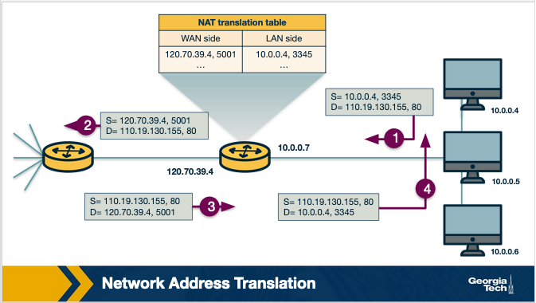

The translation table provides a mapping between the public facing IP address/ports, and the IP addresses/ports that belong to hosts inside the private network. For example, let’s assume that a host 10.0.0.1 inside the private network, uses port 3345 to send traffic to a host in the public Internet with IP address 128.119.40.186 and port 80. Then the NAT table says that packets with the source IP address of 10.0.0.1 and source port 3345, they should be rewritten to a source address 138.76.29.7 and a source port of 5001 (or any source port number that is not currently used in the NAT translation table). Similarly, packets with a destination IP address of 138.76.29.7 and destination port of 5001, they will be rewritten to destination IP address 10.0.0.1 and destination port 3345. 

### Why the NAT boxes violate the e2e principle?

The hosts that are behind NAT boxes are not globally addressable, or routable. As a result, it is not possible for other hosts on the public Internet to initiate connections to these devices. So, if we have a host behind a NAT and a host in the public Internet, then by default they cannot communicate without the intervention of a NAT box. 

There are some workarounds to allow hosts to initiate connections to hosts that behind NATs. Some example tools and protocols include STUN (a tool that allows hosts to discover NATs and the public IP address and port number that the NAT has allocated for the application that the host wants to communicate with), and UDP hole punching (it established bidirectional UDP connections between hosts behind NATs).

## The Hourglass Shape of Internet Architecture

The Internet protocol stack has a layered architecture that resembles an hourglass shape. **Was the Internet architecture always shaped like an hourglass, and there has always been a single protocol at the network layer?** If we look back in the early nineties, we will see that there were several other network-layer protocols that were competing with IPv4. For example, Novell’s IPX and the X.25 network protocol used in Frame Relay. So the network layer did not include only one protocol, but there were multiple protocols that were competing with each other at that time.

**Why has there have been more frequent innovations at the lower or higher layers of the protocol hourglass? Why have the protocols at the waist of the hourglass (mostly IPv4, TCP, and UDP) been difficult to replace, and have they outcompeted any protocols that offer the same or similar functionalities?** Looking ahead, and assuming that we want to design and introduce new and potentially better protocols, how can we make it more likely that the new protocols will outcompete and replaces existing and widely used incumbent protocols?

Researchers have suggested a model called the **Evolutionary Architecture** model, or **EvoArch**, that can help to study layered architectures and their evolution in a quantitative manner. Through this model researchers were able to explain how the hierarchical structure of the layer architecture eventually lead to the hourglass shape.

In the next topic, we will talk about the details of the model and how it can help us explain the evolution of the Internet architecture.

## Evolutionary Architecture Model

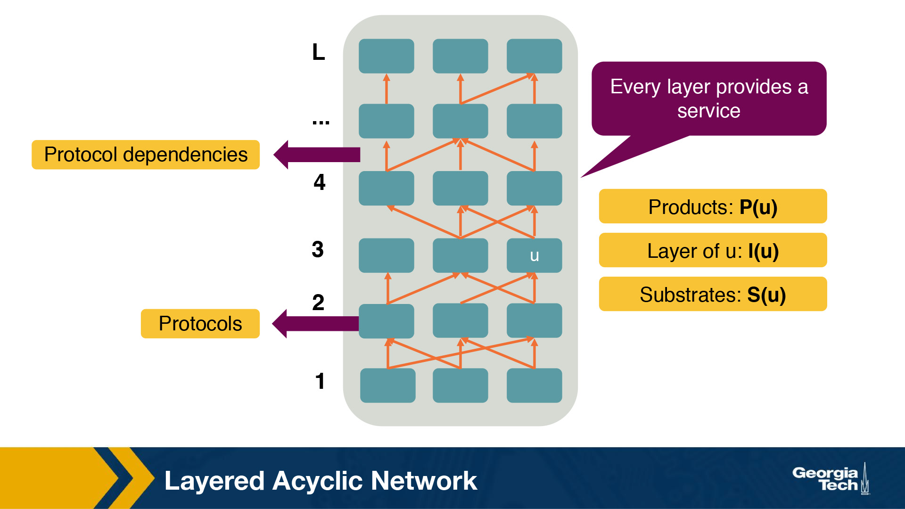

In this section, we will talk about a model that attempts to answer our previous questions. Researchers have suggested a model - the **Evolutionary Architecture model** or **EvoArch** - that can help to study layered architectures, and their evolution in a quantitative manner. The EvoArch model considers an abstract model of the Internet’s protocol stack that has the following components:

- **Layers:** A protocol stack is modeled as a directed and acyclic network with `L` layers.

- **Nodes:** Each network protocol is represented as a node. The layer of a node `u` is denoted by `l(u)`.

- **Edges:** Dependencies between protocols are represented as directed edges.

- **Node incoming edges:** If a protocol `u` at layer `l` uses the service provided by a protocol `w` at the lower layer `l−1`, then this is represented by an “upwards” edge from `w` to `u`.

- **Node substrates:** We refer to substrates of a node `u`, `S(u)`, as the set of nodes that `u` is using their services. Every node has at least one substrate, except the nodes at the bottom layer.

- **Node outgoing edges:** The outgoing edges from a node `u` terminate at the products of `u`. The products of a node `u` are represented by `P(u)`.

- **Layer generality:** Each layer is associated with a probability `s(l)`, which we refer to as layer generality. A node `u` at layer `l+1` selects independently each node of layer `l` as the substrate with probability `s(l)`. The layer generality decreases as we move to higher layers, and thus protocols at lower layers are more general in terms of their functions or provided services than protocols at higher layers. For example, in the case of the Internet protocol stack, layer 1 is very general and the protocols at this layer offer a very general bit transfer service between two connected points, which most higher layer protocols would use.

- **Node evolutionary value:** The value of a protocol node, `v(u)`, is computed recursively based on the products of `u`. By introducing the evolutionary value of each node, the model captures the fact that the value of a protocol `u` is driven by the values of the protocols that depend on it. For example, let’s consider again the Internet protocol stack. TCP has a high evolutionary value because it is used by many higher layer protocols and some of them being valuable themselves. Let’s assume that we introduce a brand new protocol, at the same layer as TCP, that may have better performance or other great new features. The new protocol’s evolutionary value will be low if it is not used by important or popular higher layer protocols, regardless of the great new features it may have. So the evolutionary value determines if the protocol will survive the competition with other protocols, at the same layer, that offer similar services.    

- **Node competitors and competition threshold:** We refer to the competitors of a node `u`, `C(u)`, as the nodes at layer `l` that share at least a fraction `c` of node `u`’s products. We refer to the fraction `c`, as the competition threshold. So, a node `w` competes with a node `u`, if `w` shares at least a fraction `c` of `u`’s products.

- **Node death rate:** The model has a death and birth process in place, to account for the protocols that cease or get introduced respectively. The competition among nodes becomes more intense, and it is more likely that a protocol `u` dies if at least one of its competitors has a higher value than itself. When a node `u` dies, then its products also die, if their only substrate is `u`.

- **Node basic birth process:** The model, in its simplest version, has a basic birth process in place, where a new node is assigned randomly to a layer. The number of new nodes at a given time is set to a small fraction (say 1% to 10%) of the total number of nodes in the network at that time. So, the larger a protocol stack is, then the faster it grows.

### Toy Example
To illustrate the above model and the parameters, let’s consider a toy network example with L equal to 4 layers. The evolutionary value of each node is shown inside each circle. The generality probability for each layer is shown at the left of each layer, and it is denoted as s(l). As we noted earlier, the generality of the layers decreases as we move to higher layers, so on average, the number of products per node decreases as well. Let’s further assume that we have a competition threshold c = ⅗. Nodes u, q and w compete in layer 2. U and q compete, but this is unlikely to cause q to die because u and q have comparable evolutionary values. In contrast, it is likely that w will die because its value is much less than that of its maximum-value competitor, u.

### EvoArch iterations
EvoArch is a discrete-time model that is executed over rounds. At each round, we perform the following steps: A) We introduce new nodes, and we place them randomly at layers. B) We  examine all layers, from the top to the bottom, and we perform the following tasks: 
1. We connect the new nodes that we may have just introduced to that layer, by choosing substrates based on the generality probabilities of the layer below s(l−1), and by choosing products for them based on the generality probability of the current layer s(l).
2. We update the value of each node at each layer l, given that we may have new nodes added to the same layer l.
3. We examine all nodes, in order of decreasing value in that layer, and remove the nodes that should die. C) Finally, we stop the execution of the model when the network reaches a given number of nodes.

The figure above shows the width of each layer we execute the EvoArch model for a network of 10 layers over multiple rounds. The main takeaway message from this figure is that the layer width decreases as we move from the bottom layer to a middle layer, around layer 5, and then it increases again as we move towards the top layer. 

### Implications for the Internet Architecture and future Internet architecture
With the help of the EvoArch model, how can we explain the survival of the TCP/IP stack given that it appeared around the 70s or 80s when the telephone network was very powerful? The EvoArch model suggests that the TCP/IP stack was not trying to compete with the telephone network services. The TCP/IP was mostly used for applications such as FTP, E-mail, and Telnet, so it managed to grow and increase its value without competing or being threatened by the telephone network, at that time that it first appeared. Later it gained even more traction, with numerous and powerful applications relying on it.   

IPv4, TCP, and UDP provide a stable framework through which there is an ever-expanding set of protocols at the lower layers (physical and data-link layers), as well as new applications and services at the higher layers. But at the same time, these same protocols have been difficult to replace or even modify significantly. EvoArch provides an explanation for this. A large birth rate at the layer above the waist can cause death for the protocols at the waist if these are not chosen as substrates by the new nodes at the higher layers. The waist of the Internet architecture is narrow, but also the next higher layer (the transport layer) is also very narrow and stable. So, the transport layer acts as an “evolutionary shield” for IPv4, because any new protocols that might appear at the transport layer are unlikely to survive the competition with TCP and UDP which already have multiple products. In other words, the stability of the two transport protocols adds to the stability of IPv4, by eliminating any potential new transport protocols, that could select a new network layer protocol instead of IPv4.

Finally, in terms of future and entirely new Internet architectures, the EvoArch model predicts that even if these brand new architectures do not have the shape of an hourglass initially, they will probably do so as they evolve, which will lead to new ossified protocols. The model suggests that one way to proactively avoid these ossification effects, that we now experience with TCP/IP, a network architect should try to design the functionality of each layer so that the waist is wider, consisting of several protocols that offer largely non-overlapping but general services, so that they do not compete with each other.

***What are some of the ramifications of the “hourglass shape of the internet”?***

- Many technologies that were not originally designed for the internet have been modified so that they have versions that can communicate over the internet (such as Radio over IP).Modifying a technology so that it is compatible with the rest of the internet (i.e., by making it compatible with IP) greatly enhances market penetration (from the vendor’s perspective), and/or decreases the amount of extra development that would need to happen.

- It has been a difficult and slow process to transition to IPv6, despite the shortage of public IPv4 addresses. A big part of the Internet infrastructure uses IPV4 while the cost of transitioning is high. This reflects as a consequence of the narrow waist.

## Architecture Redesign

### Why a clean-slate design approach?
Some of the major design principles of the current Internet architecture are layering, packet switching, a network of collaborating networks, intelligent end-systems as well as the end-to-end argument. Despite our initial intentions, the Internet is currently facing major challenges in multiple areas such as security, resilience and availability, scalability and management, quality of service, user experience, and economics. But what if we redesigned the Internet architecture from scratch? Many researchers believe that it is necessary, and timely, to rethink the fundamental assumptions and design decisions via a clean-slate design approach. That clean-slate approach would be based on out of the box thinking, the design of new network architectures, and experimentation to evaluate the new ideas, to improve them and also to give them a realistic chance of deployment. 

### The clean-slate design as a process
An important aspect about designing new Internet architectures through a clean-slate approach, is the ability to deploy and thoroughly test them, which can take place at an appropriate experimental facility. Such a facility has to fulfill some requirements such as offer a large scale infrastructure, include different technologies, attract real users and their traffic, enable parallel experiments with distinct networking architectures such as different naming schemes, different layering approaches, and different forwarding techniques, while at the same time, new services should be able to explore the new capabilities and should be made available to users who opt-in. In this context, a clean-slate should be viewed as a design process, rather than as a result in itself. Through this process, we may identify innovative services and applications, which may become mature enough to be commercially deployed on the existing Internet. Another possibility may be that we may create an entirely new network architecture, which eventually replaces today’s architecture. Or perhaps, the most “conservative” outcome may even be that we learn that the current Internet architecture is the “best” possible solution. On the other hand, the most “radical” outcome can be that such an experimental facility, which allows multiple sub-system architectures and network services to co-exist, becomes the blueprint for the future Internet.

### Redesigning the Internet architecture to optimize for control and management
One research group (“4D”) for example, started from a small set of clean slate design principles different from those of the Internet today: network-level objectives, network-wide views, and direct control, with functionality in four components: the data, discovery, dissemination, and decision planes. In their work, the decision plane has a network-wide view of the topology and traffic, and exerts direct control over the operation of the data plane – radically different from today’s Internet - no decision logic is hardwired in protocols distributed among the network elements. The output of the decision logic is communicated to routers/switches by the dissemination plane. Their work investigates an extreme design point where the decision logic is completely separated from distributed protocols. The 4D group argues that technology trends toward ever-more powerful, reliable, and inexpensive computing platforms make their design point attractive in practice. [Greenberg 2005]

### Redesigning the Internet architecture to offer better accountability
Given the fact that IP network layer provides little to no protection against misconfiguration or malicious actions which occur frequently, Researchers proposed network “accountability” in order to establish the foundation for defenses against those behaviors. Accountability is an ability to associate each action with the responsible entity. The proposed work addressed two accountabilities, i.e., source accountability and control-plane accountability, and illustrated that both accountabilities could be improved by a network layer called Accountable Internet Protocol (AIP). 

Source accountability is the ability to trace actions to a particular end host and stop that host from misbehaving. It is necessary to describe the address format of AIP first and then illustrate how AIP improved source accountability. AIP addresses are of the form AD:EID, where AD is the identifier for the network that the host belongs to, and EID is a globally unique host identifier. For source accountability, AIP makes use of this self-certifying addressing to develop simple mechanisms that verify the source of packets and drop the packets if the sources are spoofed. In addition, AIP can throttle certain forms of unwanted traffic using a simple “shut-off message”. 

Control-plane accountability is the ability to pinpoint and prevent attacks on routing. The proposed work suggested ways to improve control-plane accountability by providing origin authentication (ensuring that the network that appears to originate paths is indeed the correct network) and path authentication (checking the integrity of the network path) to detect misleading route advertisements.

## Interconnecting Hosts and Networks

We have different types of devices that help to provide connectivity between hosts that are in the same network, or help interconnect networks. These devices offer different services and they operate over different layers. 

**Repeaters and Hubs:** They operate on the physical layer (L1), as they receive and forward digital signals to connect different Ethernet segments. They provide connectivity between hosts that are directly connected (in the same network). The advantage is that they are simple and inexpensive devices, and they can be arranged in a hierarchy. Unfortunately, hosts that are connected through these devices belong to the same collision domain, meaning that they compete for access to the same link. 

**Bridges and Layer2-Switches:** These devices can enable communication between hosts that are not directly connected. They operate on the data link layer (L2) based on MAC addresses. They receive packets and they forward them to reach the appropriate destination. A limitation is the finite bandwidth of the outputs. If the arrival rate of the traffic is higher than the capacity of the outputs then packets are temporarily stored in buffers. But if the buffer space gets full, then this can lead to packet drops. 

**Routers and Layer3-Switches:** These are devices that operate on Layer 3. We will talk more about these devices and the routing protocols on the following lectures.

## Learning Bridges

A bridge is a device with multiple inputs/outputs. A bridge transfers frames from an input to one (or multiple) outputs. Though it doesn’t need to forward all the frames it receives. In this topic we will talk about how a bridge learns how to perform that task.  

A learnings bridge learns, populates and maintains, a forwarding table.  The bridge consults that table so that it only forwards frames on specific ports, rather than over all ports.  

For example, let’s consider the topology on the following figure.  When the bridge receives a frame on port 1, with source Host A and destination Host B, the bridge does not have to forward it to port 2.

**So how does the bridge learn?** When the bridge receives any frame this is a “learning opportunity” to know which hosts are reachable through which ports. This is because the bridge can view the port over which a frame arrives and the source host. Going back to our example topology, eventually the bridge builds the following forwarding table.

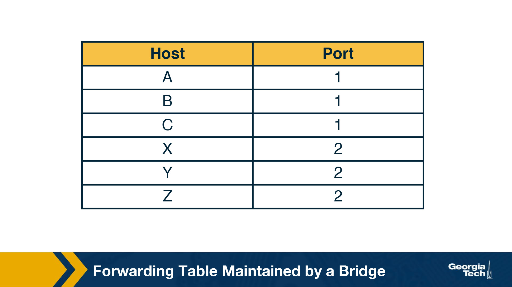

## Looping Problem in Bridges and the Spanning Tree Algorithm

Unfortunately using bridges to connect LAN’s fails, if the network topology results in loops (cycles). In that case, the bridges loop through packets forever!  

The answer to this problem is excluding links that lead to loops by running the spanning tree algorithm. Let’s represent the topology of the network as a graph. The bridges are represented as nodes and the links between the bridges are represented as edges. The goal of the spanning tree algorithm is to have the bridges select which links (ports) to use for forwarding eliminating loops. 

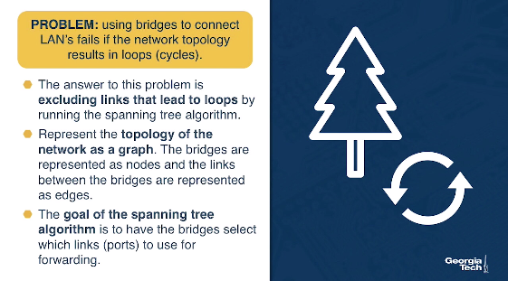

Let’s take a look at how bridges run this distributed algorithm. 

Every node (bridge) in the graph has an ID. The bridges eventually select one bridge as the root of the topology. Let’s see how this selection happens.

The algorithm runs in “rounds” and at every round each node sends to each neighbor node a configuration message with three fields: a) the sending node’s ID, b) the ID of the roots as perceived by the sending node, and c) the number of hops between that (perceived) root and the sending node.  

At every round, each node keeps track of the best configuration message that it has received so far, and it compares that against the configuration messages it receives from neighboring nodes at that round. 

At the very first round of the algorithm, every node thinks that it is the root. So for a node with an ID 3 for example, the node sends a configuration message  <3, 3, 0> to its neighbors. Note that the distance of the node from itself (perceived root) is 0. 

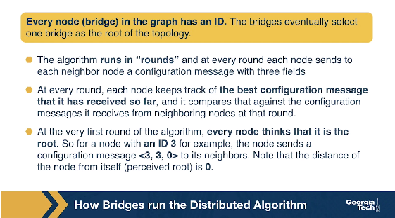

So how does a node compare two configuration messages? Between two configurations, a node selects one configuration as better if: a) The root of the configuration has a smaller ID, or if b) The roots have equal IDs, but one configuration indicates smaller distance from the root, or if c) Both roots IDs are the same and the distances are the same, then the node breaks the tie by selecting the configuration of the sending node that has with the smallest ID. In addition, a node stops sending configuration messages over a link (port), when the node receives a configuration message that indicates that it is not the root, eg when it receives a configuration message from a neighbor that: a) either closer to the root, or b) it has the same distance from the root, but it has a smaller ID.  

As an example, let’s consider the topology below. By running the above steps on this topology, we note that in the first round B3 receives (B2,B2,0) and (B5,B5,0), so it accepts B2 as the root. So in the second round it sends (B3,B2,1) to its neighbors.  

Similarly for B2; In the first round, B2 receives (B3,B3,0) and (B1,B1,0), it accepts B1 as the root. So in the second round B2 sends (B2,B1,1). 

Finally, B5 receives configuration messages from B3, B7 and B1. B5 accepts B1 as root and sends (B5, B1, 1) to B3. This results to B3 also accepting B1 as root. In addition, B3 realizes that both its neighbors, namely B2 and B5 are closer to the root (B1) than itself. This causes B3 to not select any of its links (ports). So B3 stops participating in forwarding traffic.

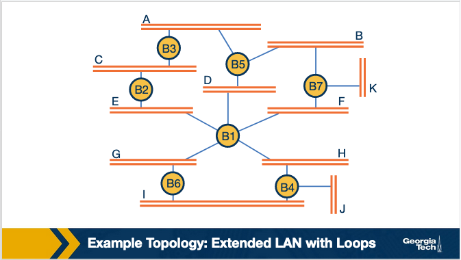

The resulting spanning tree is:

***Which of the following statements are correct?***

- The Spanning Tree Algorithm helps to prevent broadcast storms. This is the purpose of the Spanning Tree Algorithm. Although it is still possible to have broadcast storms on the network (such as from a bad network card), STP prevents broadcast storms that result from having loops present in the network topology.
