# Router Design and Algorithms (Part 2)

## Why We Need Packet Classification?

As the Internet becomes increasingly complex, networks require quality of service guarantees and security guarantees for their traffic. Packet forwarding based on the longest prefix matching of destination IP addresses is not enough and we need to handle packets based on multiple criteria (TCP flags, source addresses) - we refer to this finer packet handling as packet classification. 

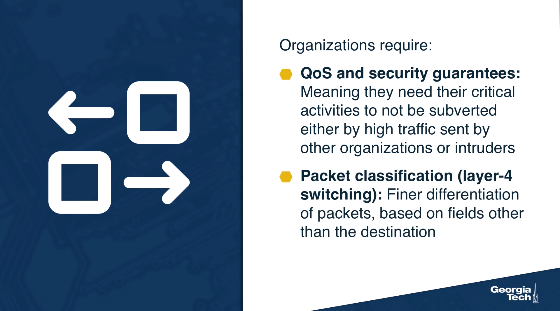

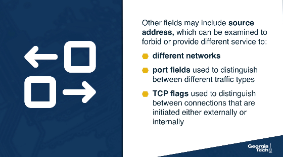

**Variants of packet classification are already established:** 

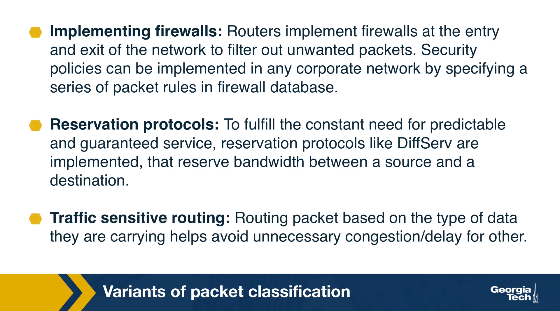

1. **Firewalls:** Routers implement firewalls at the entry and exit points of the network to filter out unwanted traffic, or to enforce other security policies.

2. **Resource reservation protocols:** For example, DiffServ has been used to reserve bandwidth between a source and a destination.

3. **Routing based on traffic type:** Routing based on the specific type of traffic helps avoid delays for time-sensitive applications.

**Example for traffic type sensitive routing:**

The above figure shows an example topology where networks are connected through router R. Destinations are shown as S1, S2, X, Y and D. L1 and L2 denote specific connection points for router R. The table shows some example packet classification rules. The first rule is for routing video traffic from S1 to D via L1. The second rule drops all traffic from S2, for example, in the scenario that S2 was an experimental site. The third rule reserves 50 Mbps of traffic from prefix X to prefix Y, which is an example of rule for resource reservation.

## Packet Classification: Simple Solutions

Before looking into algorithmic solutions to the packet classification problem, let's take a look at simplest approaches that we have: 

### Linear Search

Firewall implementations perform a linear search of the rules database and keep track of the best-match rule. This solution can be reasonable for a few rules but the time to search through a large database that may have thousands of rules can be prohibitive.  

### Caching

Another approach is to cache the results so that future searches can run faster. This has two problems:

1. The cache-hit rate can be high (eg 80-90%), but still we will need to perform searches for missed hits.  

2. Even with a high 90% hit rate cache, a slow linear search of the rule space will result in poor performance. For example, suppose that a search of the cache costs 100 nsec (one memory access) and that a linear search of 10,000 rules costs 1,000,000 nsec = 1 msec (one memory access per rule). Then the average search time with a cache hit rate of 90% is still 0.1 msec, which is rather slow.

### Passing Labels

The Multiprotocol Label Switching (MPLS) and DiffServ use this technology. MPLS is useful for traffic engineering. A label-switched path is set up between the two sites A and B. Before traffic leaves site A, a router does packet classification and maps the web traffic into an MPLS header. Then the intermediate routers between A and B apply the label without having to redo packet classification. DiffServ follows a similar approach, applying packet classification at the edges to mark packets for special quality of service.

## Fast Searching Using Set-Pruning Tries

Let's assume that we have a two-dimensional rule. For example, we want to classify packets both using the source and the destination IP addresses. 

As an example, let's consider the table below as our two-dimensional rule. 

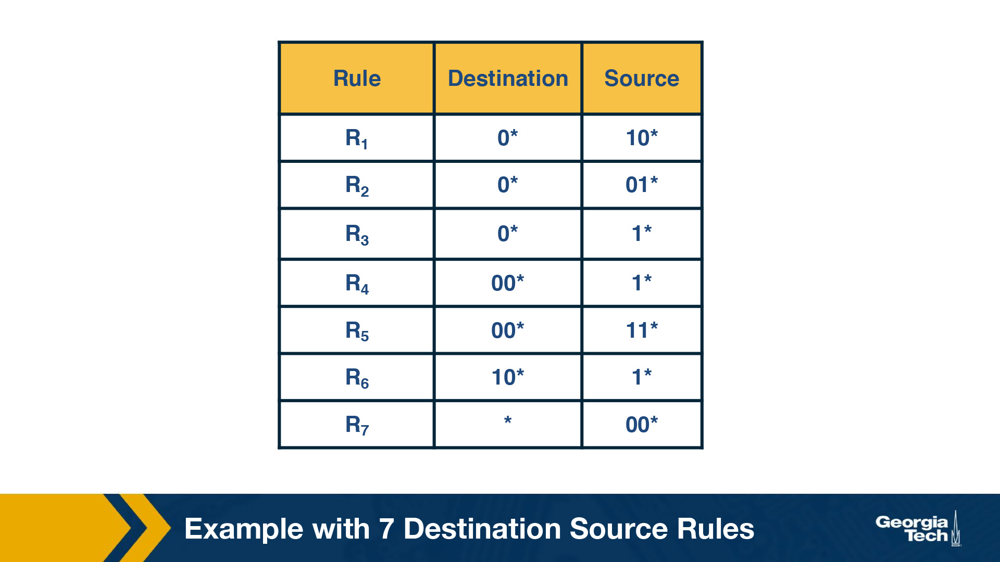

The simplest way to approach the problem would be to build a trie on the destination prefixes in the database, and then for every leaf-node at the destination trie to “hang” source tries. 

We start building a trie that looks like this figure below:

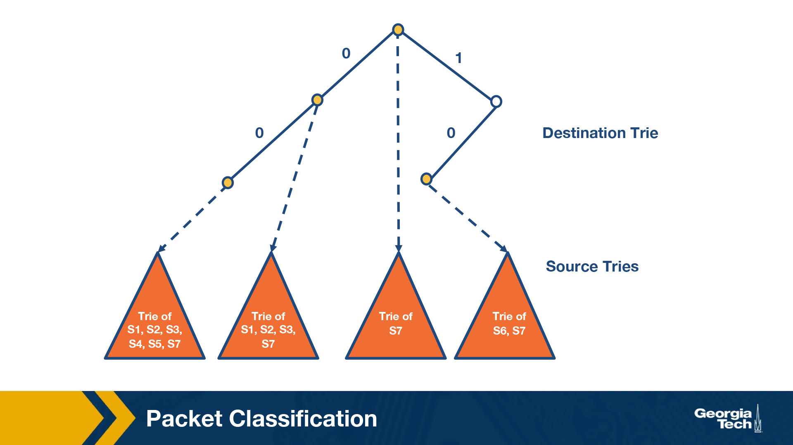

By S1 we denote the source prefix of rule R1, S2 of rule R2, etc. Thus for every destination prefix D in the destination trie we “prune” the set of rules to those that are compatible with D. 

We first match the destination IP address in a packet in the destination trie. Then we traverse the corresponding source trie to find the longest prefix match for the source IP. The algorithm keeps track of the lowest-cost matching rule. The algorithm concludes with the least-cost rule.

**Challenge.** The problem that we need to solve now, is which source prefixes to store at the sources tries? For example, let's consider the destination D = 00∗. Both rules R4 and R5 have D as the destination prefix. So the source tries for D will need to include the source prefixes 1∗ and 11∗. 
But if we restrict to 1* and 11*, then this is not sufficient. Because the prefix 0∗, also matches 00*,  and it is found in rules R1, R2, R3, R7. So we will need to include all the corresponding source prefixes. 

Moving forward, the problem with the set pruning tries is memory explosion. Because a source prefix can occur in multiple destination tries.

## Reducing Memory Using Backtracking

The set pruning approach has high cost in memory to reduce time. 

The opposite approach is to pay in time to reduce memory. 

Lets assume a destination prefix D. The backtracking approach has each destination prefix D point to a source trie that stores the rules whose destination field is exactly D. The search algorithm then performs a “backtracking” search on the source tries associated with all ancestors of D.

So first, the algorithm goes through the destination trie and finds the longest destination prefix D matching the header. Then it works its way back up the destination trie and search the source trie associated with every ancestor prefix of D that points to a nonempty source trie. 

Since each rule now is stored exactly once, the memory requirements are lower than the previous scheme. But, the lookup cost for backtracking is worse than for set-pruning tries.

## Grid of Tries

We have previously seen two solutions for the two dimensional problem: a) the set pruning approach and b) backtracking. 

The set pruning approach has a high cost in memory. Because we construct a trie on the destination prefixes, and then for every destination prefix, we have a trie on the source prefixes. 

On the other hand, the backtracking approach has a high cost in terms of time. Because we first traverse the destination trie to find the longest prefix match and then we need to work our way backwards to the destination trie to search for the source trie associated with every prefix of our previous match.

With the grid of tries approach, we can reduce the wasted time in the backtracking search by using precomputation. When there is a failure point in a source trie, we precompute a switch pointer. Switch pointers take us directly to the next possible source trie that can contain a matching rule. 

Let’s look at an example. Consider that we search for the packet with destination address 001 and source address 001. We start the search with the destination trie which gives us D = 00 as the best match. The search at that point for the source trie, fails. Instead of backtracking, the grid of tries has a switch pointer (labeled 0) that points to x. At which point it fails again. We follow another switch pointer to node y. At that point the algorithm terminates. 

So the precomputed switch pointers allow us to take shortcuts. Using these pointers we do not do backtracking to find an ancestor node and then to traverse the source trie. We still proceed to match the source, and we keep track of our current best source match. But we are skipping source tries with source fields that are shorter than our current source match.  

## Scheduling and Head of Line Blocking

In this topic, we start discussing about the problem of scheduling.

### Scheduling

Let’s assume that we have an NxN crossbar switch, with N input lines, N output lines, and N2 crosspoints. Each crosspoint needs to be controlled (on/off), and we need to make sure that each input link is connected with at most one output link. Also, for better performance we want to maximize the number of input/output links pairs that communicate in parallel. 

### Take the ticket algorithm

A simple scheduling algorithm is the “take the ticket algorithm”. Each output line maintains a distributed queue for all input lines that want to send packets to it. When an input line wants to send a packet to a specific output line, it requests a ticket. The input line waits for the ticket to be served. At that point, the input line connects to the output line, the crosspoint is turned on, and the input line sends the packet. 

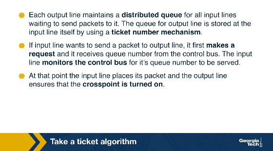

As an example, let’s consider the figure below that shows three input lines which want to connect to four output lines. Next to each input line, we see the queue of the output lines it wants to connect with. For example, input lines A and B want to connect with output lines 1,2,3.

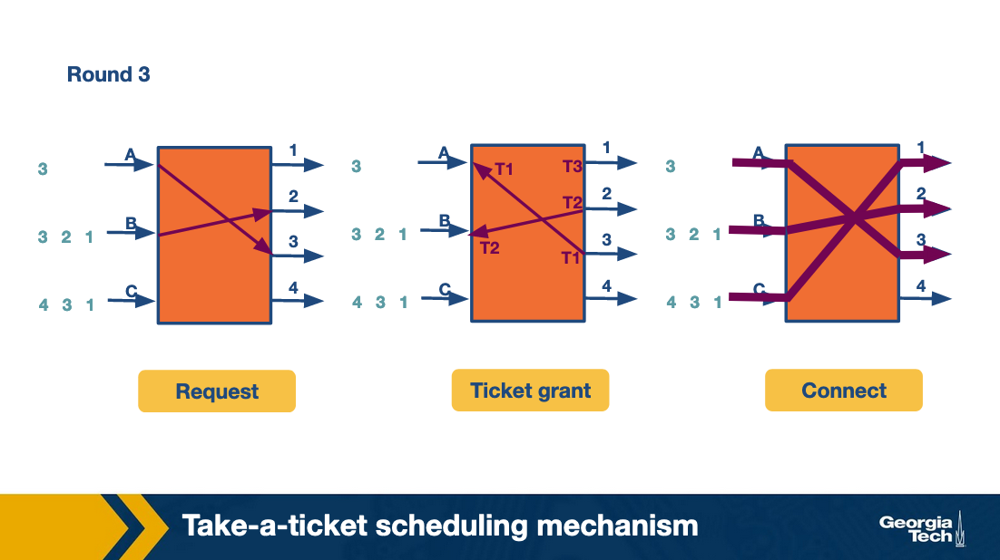

At the first round, the input lines make ticket requests. For example line A requests a ticket for link1. The same for B and C. So output link 1 grants three tickets, and it will process them in order. First the ticket for A, then for B and then for C. Input A observes that its ticket is served, so it connects to output link 1 and sends the packet.    

At the second round, A repeats the process to request a ticket and connect with link 2. Also B requests a ticket and connects with link 2.

At the third round, A and B move forward repeating the steps for their next connection. C gets the chance to make its first request and connect with output link 1. All this time C was blocked waiting for A and B.    

The following figure, which shows how the entire process progresses. For each output link we can see the time line as it connects with input links. The empty spots mean there was no packet send at the corresponding time.

As we see, in the first iteration while A sends its packet, the entire queue for B and C are waiting. We refer to this problem as head-of-line (HOL) blocking because the entire queue is blocked by the progress of the head of the queue.

## Avoiding Head of Line Blocking

### Avoiding head-of-line blocking via output queuing:

Suppose that we have an NxN crossbar switch. Can we send the packet to an output link without queueing? If we could, then assuming that a packet arrives at an output link, it can only block packets that are sent to the same output link. We could achieve that, if we have the fabric running N times faster than the input links. 

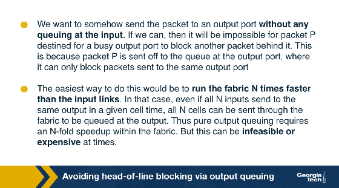

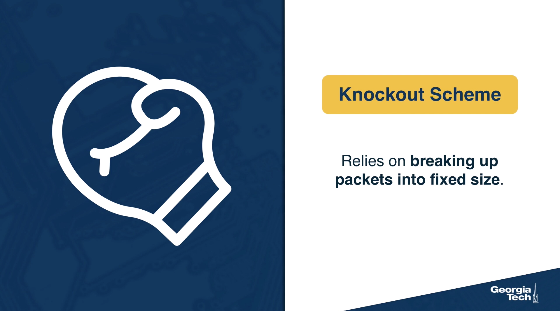

A practical implementation of this approach is the Knockout scheme. It relies on breaking up packets into fixed size (cell). We suppose that in practice the same output rarely receives N cells and the expected number is k (smaller than N). Then we can have the fabric running k times as fast as an input link, instead of N. We may still have scenarios where the expected case is violated. To accommodate these scenarios, we have one or more of a primitive switching element that randomly picks the chosen output:

- k = 1 and N = 2. Randomly pick the output that is chosen. The switching element in this case is called a concentrator.
- k = 1 and N > 2. One output is chosen out of N possible outputs. In this case, we can use the same strategy of multiple 2-by-2 concentrators.
- k needs to be chosen out of N possible cells, with k and N arbitrary values. We create k knockout trees to calculate the first k winners. 
The drawback with this approach is that is it is complex to implement.

### Avoiding head-of-line blocking by using parallel iterative matching:

The main idea is that we can still allow queueing for the input lines, but in such a way so we avoid the head of line blocking. With this approach, we schedule both the head of the queue but also more packets, so that the queue makes progress in the case that the head is blocked. 

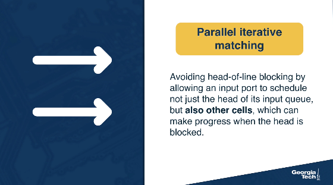

How can we do that? Let's suppose that we have a single queue at an input line. We break down the single queue into virtual queues, with one virtual queue per output link. 

Let's consider the following graph that shows A, B, C input links and 1, 2, 3, 4 output links. 

The algorithm runs in three rounds. 

In the first round, the scheme works by having all inputs send requests in parallel to all outputs they want to connect with.  This is the request phase of the algorithm. 

In the grant phase, the outputs that receive multiple requests pick a random input, so the output link 1 randomly chooses B. Similarly, the output link 2 randomly chooses A (between A and B).

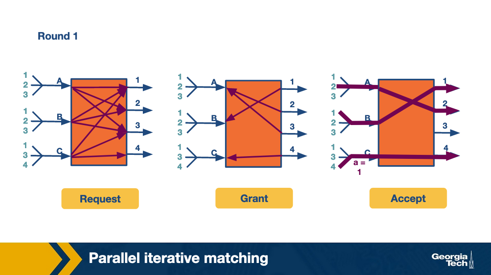

Finally, in the accept phase, inputs that receive multiple grants randomly pick an output to send to. 

We have two output ports (2 and 3) that have chosen the same input (A). A randomly chooses port 2. B and C choose 1 and 4, respectively. 

In the second round, the algorithm repeats by having each input send to two outputs. And finally the third row repeats by having each input send to one output. 

Thus in four cell times (of which the fourth cell time is sparsely used and could have been used to send more traffic) all the traffic is sent. This is clearly more efficient than the take-a-ticket.

## Scheduling Introduction

Busy routers rely on scheduling for the handling of routing updates, management queries and data packets. For example, scheduling enables routers to allow certain types of data packets to get different service from other types. It is important to note that this scheduling is done in real time. Due to the increasing link speeds (over 40 gigabit), these scheduling decisions need to be made in the minimum inter-packet times!

### FIFO with tail drop

The simplest method of router scheduling is FIFO with tail-drop. In this method, packets enter a router on input links. They are then looked up using the address lookup component – which gives the router an output link number. The switching system within the router then places the packet in the corresponding output port. This port is a FIFO (first in, first out) queue. If the output link buffer is completely full, incoming packets to the tail of the queue are dropped. This results in fast scheduling decisions, but potential loss in important data packets.

### Need for Quality of Service (QoS)

There are other methods of packet scheduling such as priority, round robin, etc. These methods are useful in providing quality of service (QoS) guarantees to a flow of packets on measures such as delay and bandwidth. A flow of packets refers to a stream of packets that travels the same route from source to destination and require the same level of service at each intermediate router and gateway. In addition, flows must be identifiable using fields in the packet headers. For example, an internet flow could consist of all packets with a either a source or destination port number of 23.

The reasons to make scheduling decisions more complex than FIFO with tail drop are:

- **Router support for congestion.**
Congestion in the internet is increasingly possible as the usage has increased faster than the link speeds. While most traffic is based on TCP (which has its own ways to handle congestion), additional router support can improve the throughput of sources by helping handle congestion.

- **Fair sharing of links among competing flows.**
During periods of backup, these packets tend to flood the buffers at an output link. If we use FIFO with tail drop, this blocks other flows, resulting in important connections on the clients’ end freezing. This provides a sub-optimal experience to the user, indicating a change is necessary!

- **Providing QoS guarantees to flows.**
One way to enable fair sharing is to guarantee certain amounts of bandwidths to a flow. Another way is to guarantee the delay through a router for a flow. This is noticeably important for video flows – without a bound on delays, live video streaming will not work well.

Thus, finding time-efficient scheduling algorithms that provide guarantees for bandwidth and delay are important!

## Deficit Round Robin

Let us look at a method to enforce bandwidth reservations in schedulers.

We saw that FIFO queue with tail drop could result in important flows being dropped. To avoid this, and introduce fairness in servicing different flows, we consider round robin. If we were to alternate between packets from different flows, the difference in packets sizes could result in some flows getting serviced more frequently. To avoid this, researchers came up with bit-by-bit round robin.

### Bit-by-bit Round Robin

Imagine a system where in a single round, one bit from each active flow is transmitted in a round robin manner. This would ensure fairness in bandwidth allocation. However, since it’s not possible in the real world to split up the packets, we consider an imaginary bit-by-bit system to calculate the packet-finishing time and send a packet as a whole. 

Let `R(t)` to be the current round number at time `t`. If the router can send `µ` bits per second and the number of active flows is `N`, the rate of increase in round number is given by

`dR / dt = µ / N`

The rate of increase in round number is indirectly proportional to the number of active flows. An important takeaway is that the number of rounds required to transmit a packet does not depend on the number of backlogged queues. 

Consider a flow `α`. Let a packet of size `p` bits arrive as the `i`-th packet in the flow. If it arrives at an empty queue, it reaches the head of the queue at the current round `R(t)`. If not, it reaches the head after the packet in front of it finishes it. Combining both the scenarios, the round number at which the packet reaches the head is given by 

`S(i) = max(R(t), F(i−1))`

where `R(t)` is the current round number and `F(i−1)` is the round at which the packet ahead of it finishes. The round number at which a packet finishes, which depends only on the size of the packet, is given by 

`F(i) = S(i) + p(i)`

where `p(i)` is the size of the `i`-th packet in the flow.

Using the above two equations, the finish round of every packet in a queue can be calculated.

### Packet-level Fair Queuing

This strategy emulates the bit-by-bit fair queueing by sending the packet which has the smallest finishing round number. At any round, the packet chosen to be sent out is garnered from the previous round of the algorithm. The packet which had been starved the most while sending out the previous packet from any queue, is chosen. Let’s consider the following example:

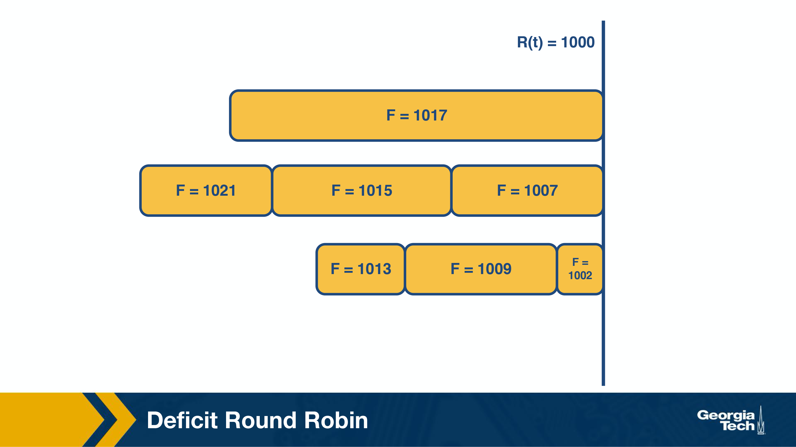

The figure above shows the state of the packets along with their finishing numbers (F) in their respective queues, waiting to be scheduled.

The packet with the smallest finishing number (F=1002) is transmitted. This represents the packet that was the most starved during the previous round of scheduling.

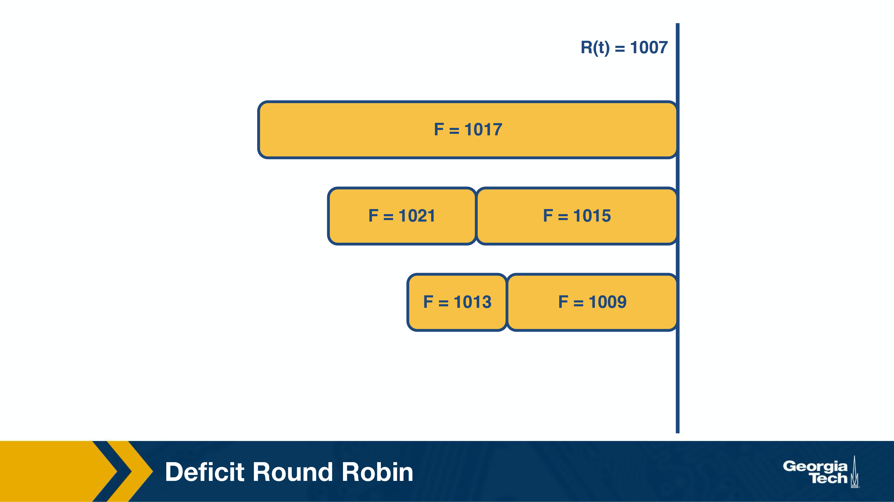

Similarly, in the next round (above figure), the packet with F=1007 is transmitted and in the subsequent round (below figure), packet with F=1009 is transmitted.

Although this method provides fairness, it also introduces new complexities. We will need to keep track of the finishing time at which the head packet of each queue would depart and choose the earliest one. This requires a priority queue implementation, which has time complexity which is logarithmic in the number of flows! Additionally, if a new queue becomes active, all timestamps may have to change – which is an operation with time complexity linear in the number of flows. Thus, the time complexity of this method makes it hard to implement at gigabit speeds.

### Deficit Round Robin (DRR)

Although the bit-by-bit round robin gave us bandwidth and delay guarantees, the time complexity was too high. It is important to note that several applications benefit only providing bandwidth guarantees. We could use a simple constant-time round robin algorithm with a modification to ensure fairness.

For each flow, we assign a quantum size, Qi, and a deficit counter, Di. The quantum size determines the share of bandwidth allocated to that flow. For each turn of round robin, the algorithm will serve as many packets in the flow i with size less than (Qi + Di). If there are packets remaining in the queue, it will store the remaining bandwidth in Di for the next run. However, if all packets in the queue are serviced in that turn, it will clear Di to 0 for the next turn.

Consider the following example of deficit round robin:

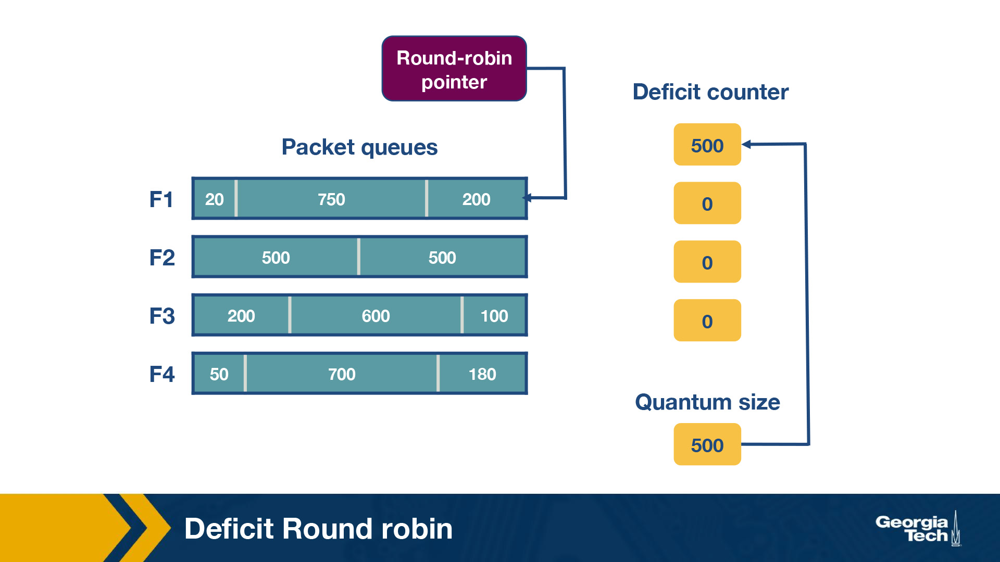

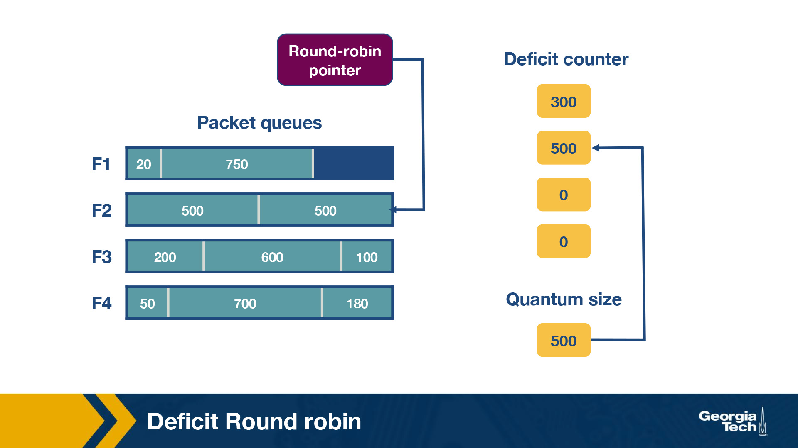

In this router, there are four flows – F1, F2, F3 and F4. The quantum size for all flows is 500. Initially the deficit counters for all flows are set to 0. Initially, the round-robin pointer points to the first flow. The first packet of size 200 will be sent through, however the funds are insufficient to send the second packet of size 750 too. Thus, a deficit of 300 will remain in D1. For F2, the first packet of size 500 will be sent, leaving D2 as empty. Similarly, the first packets of F3 and F4 will be sent with D3 = 400 and D4 = 320 after the first iteration. For the second iteration, the D1+ Q1 = 800, meaning there are sufficient funds to send the second and third packet through. Since there are no remaining packets, D1 will be set to 0 instead of 30 (which is the actual remaining amount).

## Traffic Scheduling: Token Bucket

There are scenarios where we want to set bandwidth guarantees for flows in the same queue without separating them. For example, we can have a scenario where we want to limit a specific type of traffic (eg news traffic) in the network to no more than X Mbps, without putting this traffic into a separate queue.

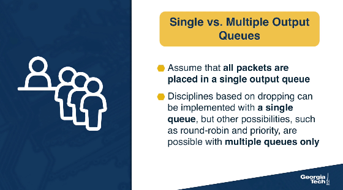

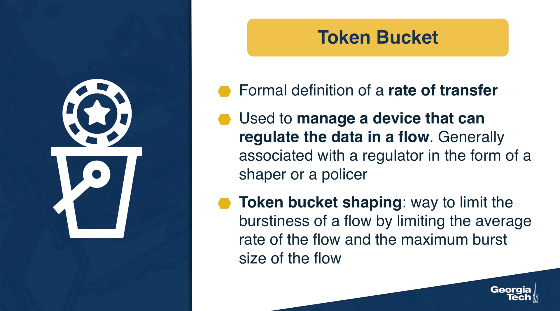

We will start by describing the idea of token bucket shaping.  This technique can limit the burstiness of a flow by: a) limiting the average rate (eg 100 Kbps), and b) limiting the maximum burst size (eg the flow can send a burst of 4KB at a rate of its choice).

The bucket shaping technique assumes a bucket per flow, that fills with tokens with rate R per second, and it also can have up to B tokens at any given time. If the bucket is full with B tokens, then additional tokens are dropped. When a packet arrives, it can go through if there are enough tokens (equal to the size of packet in bits). If not, the packet needs to wait until enough tokens are in the bucket. Given the max size of B, a burst is limited to B bits per second. 

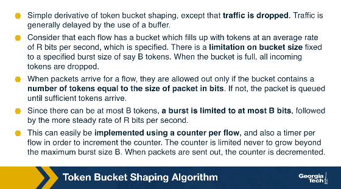

In practice, the bucket shaping idea is implemented using a counter (can’t go more than max value B, and gets decremented when a bit arrives) and a timer (to increment the counter at a rate R).

The problem with this technique is that we have one queue per flow. This is because a flow may have a full token bucket, whereas other flows may have an empty token bucket and therefore will need to wait.   

To maintain one single queue, we use a modified version of token bucket shaper, called token bucket policing. When a packet arrives will need to have tokens at the bucket already there. If the bucket is empty the packet is dropped.

## Traffic Scheduling: Leaky Bucket

***What is the difference between policing and shaping? What is leaky bucket? How is it used for traffic policing and shaping?***

Traffic policing and traffic shaping are mechanisms to limit the output rate of a link. The output rate is controlled by identifying traffic descriptor violations and then responding to them in two different ways.

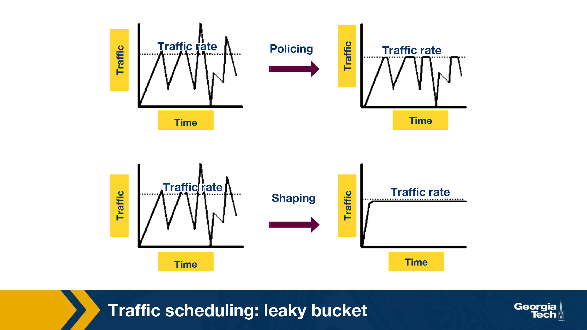

- **Policer:** When traffic rate reaches the maximum configured rate, excess traffic is either dropped, or the setting or “marking” of a packet is changed. The output rate appears as a saw-toothed wave.
- **Shaper:** A shaper typically retains excess packets in a queue or a buffer and this excess is scheduled for later transmission. The result is that excess traffic is delayed instead of dropped. Thus, when the data rate is higher than the configured rate, the flow is shaped or smoothed. Traffic shaping and policing can work in tandem.

The above figure shows the difference in the appearance of the output rate in case of traffic policing and shaping.

Leaky Bucket is an algorithm which can be used in both traffic policing and traffic shaping.

## Leaky Bucket

The leaky bucket algorithm is analogous to water flowing into a leaky bucket with the water leaking at a constant rate. The bucket, say with capacity b, represents a buffer that holds packets and the water corresponds to the incoming packets. The leak rate, r, is the rate at which the packets are allowed to enter the network, which is constant irrespective of the rate at which packets arrive. 

If an arriving packet does not cause an overflow when added to the bucket, it is said to be conforming. Otherwise, it is said to be non-conforming. Packets classified as conforming are added to the bucket while non-conforming packets are discarded. So if the bucket is full, the new packet that arrives to the bucket is dropped.

Irrespective of the input rate of packets, the output rate is constant which leads to uniform distribution of packets send to the network. This algorithm can be implemented as a single server queue.

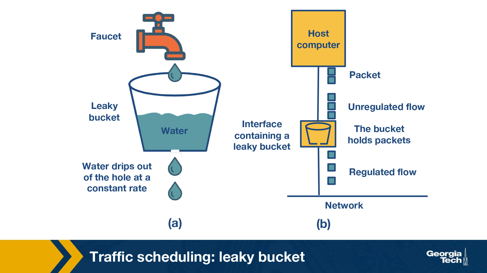

The above figure shows the analogy between a leaky bucket of water and an actual network. In this figure, the faucet corresponds to the unregulated packet sending rate into the bucket. The output from the bucket, as a result of the applied algorithm is a constant flow of packets (droplets).
